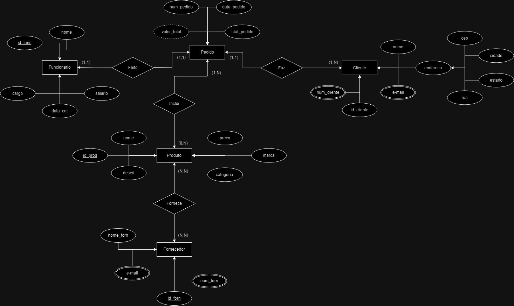

# Sistema de Gerenciamento de um Site de Vendas de Artigos Esportivos

A empresa SportsZone, especializada na venda de artigos esportivos, enfrenta um aumento significativo em sua clientela e deseja implementar um sistema de gerenciamento abrangente para melhorar sua eficiência operacional e atender às necessidades crescentes dos clientes. Este sistema incluirá entidades, atributos e relacionamentos necessários para gerenciar produtos, clientes, pedidos, fornecedores e funcionários.

 # 🚀 Entidades: 
## Produto:  
  ### Atributos:
	SKU (Stock Keeping Unit, atributo chave)
	Nome
	Descrição
	Preço
	Marca
	Categoria 
  ### Relacionamento:
 	Cada produto pode ser fornecido por um único fornecedor (N:1).  
 	Cada pedido inclui um ou muitos produtos (N:N).
## Cliente:
 ### Atributos:
	ID de Cliente (atributo chave)
	Nome
	Endereço
	E-mail
	Número de Telefone
### Relacionamento:
 	Cada cliente fez zero ou muitos pedidos (1:N).
	 
## Pedido:
  ### Atributos:
	Número de Pedido (atributo chave)
	Data do Pedido
	Status do Pedido
	Valor Total
 ### Relacionamento:
 	Cada pedido é feito por um único cliente (N:1).
 	Cada pedido inclui um ou muitos produtos (N:N). 
	
 ## Fornecedor:
  ### Atributos:
	ID de Fornecedor (atributo chave)
	Nome da Empresa
	Contato
	E-mail
	Número de Telefone
 ### Relacionamento:
 	Cada fornecedor fornece um ou muitos produtos (1:N).

 ## Fornecedor:
  ### Atributos:
	ID de Fornecedor (atributo chave)
	Nome da Empresa
	Contato
	E-mail
	Número de Telefone
 ### Relacionamento:
 	Cada fornecedor fornece um ou muitos produtos (1:N).
## Funcionário:
  ### Atributos:
	ID de Funcionário (atributo chave)
	Nome
	Cargo
	Data de Contratação
 ### Relacionamento:
 	Cada funcionário gerencia zero ou muitos pedidos (1:N).

# 🤖 Atributos:

## Atributos Simples: 
SKU, Nome, Descrição, Preço, Marca, Categoria, Nome, Endereço, Nome da Empresa, Contato, Data do Pedido, Status do Pedido, Valor Total, Cargo, Data de Contratação, E-mail, Número de Telefone.
## Atributos Compostos: 
Endereço (dividido em rua, cidade, estado e CEP).
## Atributos Multivalorados: 
Número de Telefone (um cliente pode ter vários números de telefone), E-mail (um fornecedor pode ter vários e-mails).
## Atributos Derivados: 
Valor Total do Pedido (calculado com base no preço e quantidade dos produtos em um pedido).
## Atributos Chave: 
SKU (para produtos), ID de Cliente (para clientes), Número de Pedido (para pedidos), ID de Fornecedor (para fornecedores), ID de Funcionário (para funcionários).

# 👾 Relacionamentos:

## 1:1: 
Relacionamento entre produto e fornecedor (um produto tem um único fornecedor).
## 1:N: 
Relacionamento entre cliente e pedidos (um cliente fez vários pedidos) e entre fornecedor e produtos (um fornecedor fornece vários produtos).
## N:N: 
Relacionamento entre pedidos e produtos (um pedido inclui vários produtos).

<h1>Modelagem Conceitual: </h1>

<h1>Modelagem Logica</h1>

# Modelagem fisica

Foi usado SQL Server

#Tabela funcionarios

 

 

